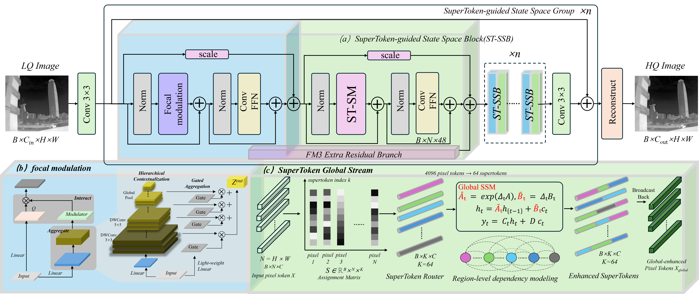
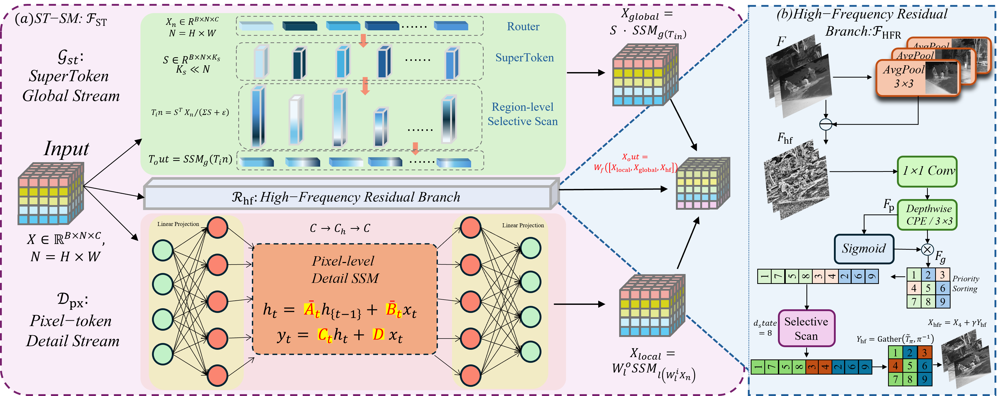
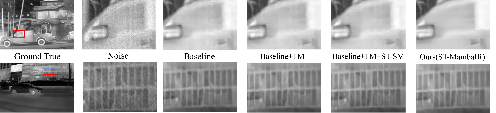

# ST-MambaIR

Official code for **ST-MambaIR: Adaptive SuperToken State Space Modeling for Thermal Infrared Image Restoration**.

ST-MambaIR is designed for thermal infrared image restoration under mixed degradations, including low-frequency non-uniformity, stripe artifacts, random noise, and weakened structural details. The model combines focal context modulation, SuperToken-guided state space modeling, and high-frequency residual refinement to balance global thermal consistency, local structure preservation, and computational efficiency.

<p align="center">
  
</p>

## Highlights

- **SuperToken-guided state space modeling**: dense pixel tokens are adaptively aggregated into compact region-level SuperTokens, enabling efficient global dependency modeling over content-aware infrared regions.
- **Dual-granularity restoration**: a global SuperToken stream captures large-scale thermal distribution and non-uniformity, while a local pixel stream preserves fine-grained contours and textures.
- **High-frequency residual refinement**: an additional refinement branch compensates weak edges and subtle thermal textures that may be smoothed during denoising.
- **Thermal infrared evaluation**: the model is trained on T234 and tested on HM-TIR, Rivadeneira2020, and WHT3H.

## Method Overview

The restoration network follows a residual image restoration framework:

1. A shallow convolution embeds the degraded thermal infrared image into feature space.
2. Stacked SuperToken-guided State Space Blocks perform deep restoration.
3. Each block uses focal context modulation, the SuperToken State-space Module, and high-frequency residual refinement.
4. A lightweight reconstruction head predicts the residual image and adds it back to the degraded input.

<p align="center">
  
</p>

The SuperToken State-space Module adaptively routes dense pixel tokens into compact region-level SuperTokens for global state space modeling, while the pixel-token stream and high-frequency residual branch retain local edges, contours, and subtle thermal textures.

<p align="center">
  
</p>

## Repository Structure

```text
basicsr/archs/mambairv2_arch.py      # main MambaIRv2/ST-MambaIR architecture implementation
basicsr/models/mambairv2_model.py    # training/testing model wrapper
options/train/CUSTOM/                # custom training configurations
scripts/                             # data preparation, evaluation, and utility scripts
docs/                                # inherited framework documentation
```

## Installation

```bash
conda create -n st-mambair python=3.10 -y
conda activate st-mambair
pip install -r requirements.txt
python setup.py develop
```

Install the CUDA/PyTorch versions that match your local GPU environment before running training or testing.

## Data Preparation

The model is trained on the mixed T234 training set and evaluated on three thermal infrared test sets: HM-TIR, Rivadeneira2020, and WHT3H.

Public dataset/source links:

- HM-TIR: [https://github.com/Zihang-Chen/HM-TIR](https://github.com/Zihang-Chen/HM-TIR)
- Rivadeneira2020: [Thermal Image Super-resolution: A Novel Architecture and Dataset](https://doi.org/10.5220/0008986201110119)

Organize paired degraded and clean infrared images as follows:

```text
datasets/
  t234/
    train/
      gt/
      noise/
    val/
      gt/
      noise/
```

For T234 training, set the paired image paths in the training option file to:

```text
datasets/t234/train/gt
datasets/t234/train/noise
datasets/t234/val/gt
datasets/t234/val/noise
```

For evaluation, prepare HM-TIR, Rivadeneira2020, and WHT3H as paired degraded/clean test sets and point the test option files to the corresponding directories. You can modify the dataset paths in `options/train/CUSTOM/*.yml` and your test option files for your local data layout.

## Training

Example:

```bash
python basicsr/train.py -opt options/train/CUSTOM/fm3_multipole_focalnet_b2_hf_residual_t234_200k_e104.yml
```

The main training setup uses:

- `model_type: MambaIRv2Model`
- `network_g.type: MambaIRv2`
- `gt_size: 128`
- `CharbonnierLoss`
- single-GPU training by default

## Testing

Use the BasicSR-style test entry after preparing a test option file and checkpoint:

```bash
python basicsr/test.py -opt options/test/CUSTOM/FMMNet_t234_200k_three_datasets_test.yml
```

Set `path.pretrain_network_g` in the option file to the checkpoint that you want to evaluate.

## Quantitative Results

The paper reports the following thermal infrared restoration results:

| Method | HM-TIR PSNR | HM-TIR SSIM | Rivadeneira2020 PSNR | Rivadeneira2020 SSIM | WHT3H PSNR | WHT3H SSIM |
| --- | ---: | ---: | ---: | ---: | ---: | ---: |
| MambaIRv2 | 34.9303 | 0.9537 | 35.2861 | 0.9599 | 36.0705 | 0.9547 |
| Xformer | 35.6892 | 0.9569 | 35.9011 | 0.9638 | 37.1932 | 0.9583 |
| ASCNet | 35.3921 | 0.9542 | 35.3871 | 0.9605 | 37.1354 | 0.9559 |
| MWDCNN | 34.1547 | 0.9489 | 32.9455 | 0.9556 | 35.6798 | 0.9519 |
| NAFNet | 35.6424 | 0.9542 | 35.5733 | 0.9609 | 37.5481 | 0.9555 |
| Restormer | 33.8069 | 0.9548 | 31.4327 | 0.9604 | 34.7396 | 0.9561 |
| SwinIR | 34.9685 | 0.9527 | 33.3781 | 0.9580 | 36.7745 | 0.9471 |
| FocalNet | 34.3702 | 0.9489 | 33.3989 | 0.9442 | 33.9343 | 0.9401 |
| **ST-MambaIR** | **35.7587** | **0.9609** | **35.9270** | 0.9582 | **39.9128** | 0.9574 |

## Visual Results

Qualitative comparisons show that ST-MambaIR suppresses non-uniform noise and stripe artifacts while preserving weak thermal boundaries and local structures.

<p align="center">
  
</p>

<p align="center">
  
</p>

<p align="center">
  
</p>

## Ablation Study

The ablation visualization compares different model variants and shows the contribution of the proposed components to noise suppression and structural detail recovery.

<p align="center">
  
</p>

## Citation

If this repository is useful for your research, please cite:

```bibtex
@article{wang2026stmambair,
  title={ST-MambaIR: Adaptive SuperToken State Space Modeling for Thermal Infrared Image Restoration},
  author={Wang, Dongming and Mou, Xingang and Huang, Ze and Zhou, Xiao},
  journal={IEEE Transactions on Image Processing},
  year={2026}
}
```

## Acknowledgement

This repository is developed on top of the BasicSR training framework. Framework files and third-party components retain their original licenses.

## License

Please see `LICENSE.txt` and `LICENSE/` for license details of the included framework and third-party components.
